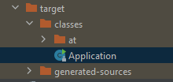
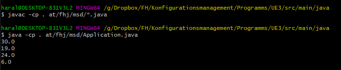

# Calculator

## Work Tasks

### create new class (own package) 
1. Create new Methods
2. add package "at/fhj/msd" and create new folder
3. import package into Application.java

 After the first run, a folder called target was created      
  

### run class via terminal

1. go to folder
2. compile the main class
3. run the main class
4. Java Compile and run      

  

**README.md** - [click here](./README.md)
