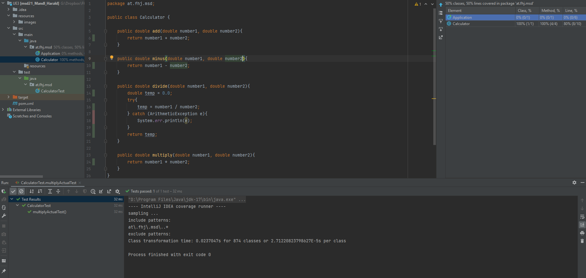
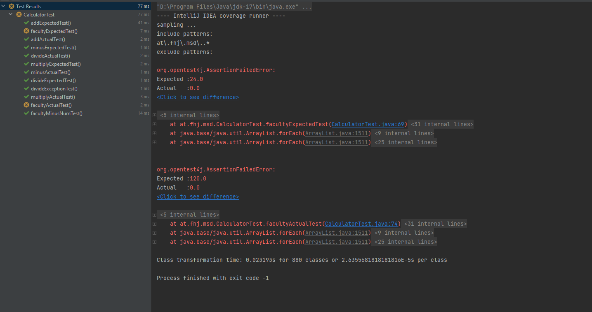

# Exercise4

## JUnit Test
 
### Test Add

- The order doesn't matter
- the size of the numbers matters.
- max int (2^31 -1)
- min int (2^31 -1)

### Test Minus

- the order is important
- the size of the numbers matters.
- max int (2^31 -1)
- min int (2^31 -1)

### Test Multiply

- The order doesn't matter
- the size of the numbers matters.
- max int (2^31 -1)
- min int (2^31 -1)
- 0 * -1 shoud be 0 and not -0

### Test Divide

- The order does matter
- the size of the numbers matters.
- max int (2^31 -1)
- min int (2^31 -1)
- 0 / n should be Infinity
- 2 / 0 should be 0

[go to README.md](./README.md)
